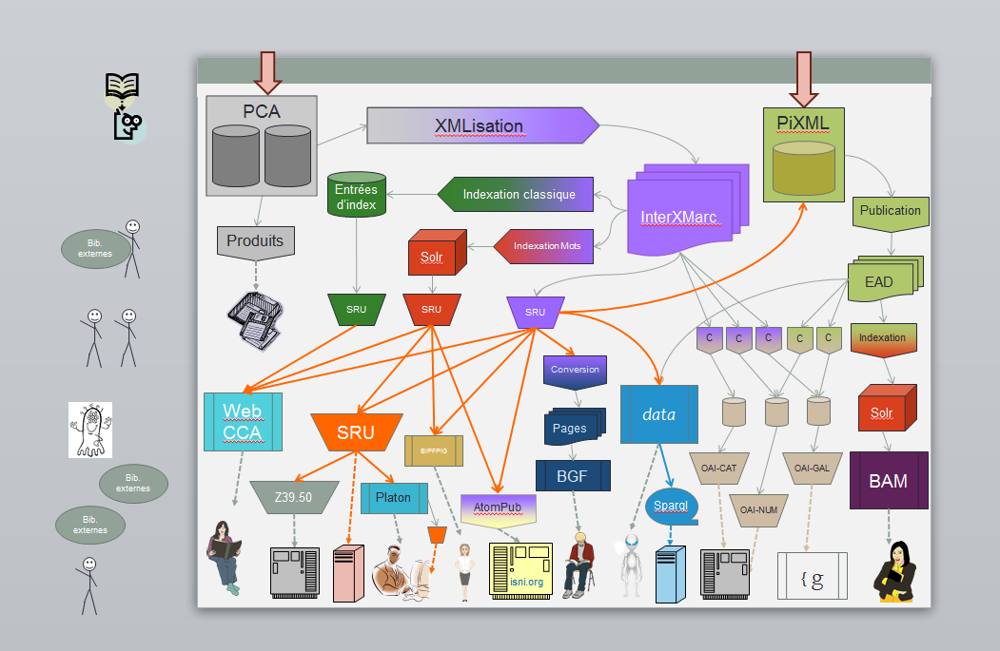
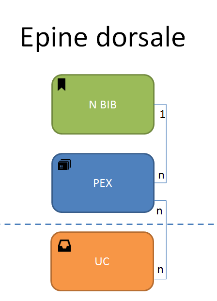

---

# PUBLIB

---


---

### Défi EIG initial

Préfigurer une plateforme de **co-production de données bibliographiques** (*métadonnées*)
qui permette la collaboration
en temps réel en interne avec d'autres institutions partenaires

---


---

### Contexte du projet

Ce projet s'inscrit dans une feuille de route de développement à 4 ans

* Développement de **pilote MD**: refonte de l'outil de production de métadonnées (notices/entités)

* Développement du **FNE**: rapprochement avec l'ABES pour la coproduction d'un Fichier National Entité

---

### Intervention de l'EIG

* Contexte et état des lieux de l'existant (4 mois):

> comprendre le flux de production des métadonnées au sein d'une institution culturelle
> comprendre le contexte, les besoins et les enjeux spécifiques

---

* Développement d'un pilote/preuve de concept (6 mois)

> Développements liminaires autour de pistes (points techniques spécifiques du projet de refonte)

* finalement reformulée en **pistes** d'intervention


---
Les pistes d'intervention
  * ETL
  * TAM
  * API FNE
  * RIM NG
  * REF Exo

Mais Réflexions autour de l'architecture et du modèle de données en amont
---

### Contexte

---
#### Une longue tradition  de l'ingénierie documentaire:

Les données bibliographiques bénéficient d'une très longue tradition
de catalogage et de référencement qui justifient leur spécificité techniques

---
  * format de catalogage interne (Intermarc)
  * protocole d'échange spécifique (SRU, Z39.50, AtomPub, ONIX, OAI)
  * format des données multiples (XML, RDF, HTML, fichiers)
  * contexte normatif international (normes ISO, AFNOR etc...)

> Très différent des contextes de développement habituel
(Veille, Recherche, BI)

---

#### Les enjeux spécifiques

Les données bibliographiques en ce qu'elle décrivent des ressources documentaires, patrimoniales et culturelles ont des enjeux spécifiques propre à leur contexte de production et d'usage

---

  * Qualité, conservation, pérennité et réutiliabilité des données
  * Fonctionnement en silos centré autour d'un catalogue (Référence doc)
  * Spécificité des données: descriptives d'objet et d'entité

---
#### Ingénierie documentaire et production de métadonnées

Le monde de production des métadonnées évoluent:
  * Evolution du métier du catalogueur (+ d'autonomie)
  * Mise en tension du métier d'informaticien documentaire (fonction support, évolution des technologies et des usages)

---

#### Divers métiers autour des métadonnées:

  - éditeurs et distributeurs,
  - conservateurs,
  - archivistes,
  - bibliotécaires,
  - catalogueurs,
  - bibliographes,
  - responsables qualité et normalisation,
  - informaticien (GED, DBA, reseaux ...)

---

#### Divers usages des métadonnées

Les usages des métadonnées sont presque exclusivement centrés autour de la consultation de ressources

  - académiques (étudiants/chercheurs)
  - professionnels & spécialistes (ex: juristes, métiers d'art)
  - documentalistes, éditeurs, bibliothécaires
  - grand public
  - robots

---

### Des enjeux spécifiques

  - obligation légale et promotion commerciale
  - mise en valeur d'un fond documentaire
  - conservation, pérennisation des ressources
  - accès, circulation et diffusion des ressources documentaires
  - ordre, granularité, fiabilité des descriptions des ressources
  - recensement exhaustif et selection de qualité
  - adaptation des données aux standards et aux normes: générique/spécifique
  - stockage, traitement, accès aux données enjeu transversal de support des enjeux

---
### Contexte BnF
---

#### Flux de production des métadonnées

Toute l'activité de catalogage repose sur une base de données PCA dont le schéma est très complexe (multiples interdépendances)

Un Fonctionnement en silo des entrées sorties avec pour centre nerveux la base de données.

---
Une vue simplifiée

```
x Entrées ==> BDD Catalogue ==> x Sorties
                  ^
                  |
        RIM <=> ADCAT O2
```
---
Une vue du SI (Sortie)

---
Une vue panoramique


---
## De multiples entrées

* Dépot légal:
  - flux automatique (ONIX)
  - flux manuel (DAE)
* Acquisition:
  - flux automatique (ONIX)
  - flux manuel (DAE)
* Coopération / Numérisation autres institutions:
  - Versement dans la base (DPI)

---

## Une chaine de traitement centrale

- Conversion
- Insertion en base PostgresQL
- Correction/édition/fusion
- Indexation (SolR)
- Conversion XML -> Insertion dans FS -> Indexation (SolR)


---

## De multiples sorties:

* Portail consultation
  - BgF (XML > HTML)
  - presse locale ancienne(XML > HTML)
  - Nouveautés Editeurs (XML> HTML)
  - Interface catalogue (WebCCA) (XML> OAI> WebCCA)

---

* SI Spécifique/Tiers
  - Infos Dépot Legal (ONIX > XML)
  - Entrepot OAI (XML)
  - autres bibliothèques (XML)
  - data.bnf.fr (XML> RDF)
  - Produits (dump SQL> files)
  - ISNI  (XML[Atom]> BDD [OCLC])

---

* Via une application ou manuel:
  - VIAF (WorldCat)
  - ISNI

---

#### Pilote MD

Refonte de l'outil de production des métadonnées implique:

* Evolution du mode de création édition fusion de la BDD catalogue pour plus d'autonomie
* Modifications du format de catalogage pour plus de souplesse et de granularité
* Ajout de données de provenance et historique pour suivi qualité et tracabilité

---

* Automatisation de certaines tâches: récupération de données, mise à jour de standard
* Permettre la collaboration dans la production des métadonnées: synchroniser les notices
* Raccourcir les temps d'indexation et de publication au catalogue

---

#### Projet BIG CAT

Tous ses objectifs gravitent en réalité autour d'une
question centrales:

quel **modèle** et quelle **architecture** pour ces métadonnées?

sur des volumes de données toujours croissants en flux tendu?

---

##### Une architecture qui permette:

* l'édition/modification multiple
* la collaboration temps réel
* le controle qualité (validation du format + normes)
* le suivi historique et la provenance
* la recherche qualifiée à la volée

---
Avant de parler de modèle ou d'architecture il convent de s'entendre sur les termes


---
## Données, métadonnées, modèles

---
### Définition

`Donnée`:
  * document/ressource
  * unité d'information figée et transmissible

---

`Métadonnée`:
  * description d'une ressource (notice/entité)
  * donnée de type descriptif sur une donnée

---

`Modèle`:
* Modèle physique des données (fichiers, BDD, textes, blob)
* Modèle descriptif des données (format, grammaire, langue, code)
* Modèle logique de données (matrice, arbre, ensemble, relations)
* Modèle conceptuel de données (sens, concept, relations, ontologie)

---

Une métadonnée dans le contexte d'une bibliothèque est la **description intellectuelle**
d'une **ressource documentaire**

Mais sa **représentation varie** en fonction des considérations métiers:
* stockage, indexation, traitement
* qualification, étiquettage
* organisation, interrogation

---

#### Les métadonnées: une ressource

L'épine dorsale représente la ressource documentaire (donnée + métadonnée)

---



---

#### Les métadonnées: une notice

Dans la pure tradition du catalogueur on différencie 2 types de notices:

* ***Notices BIB***liographique description d'une ressource

* ***Notices AUT***orité description d'une entité (personne, titre, organisation, lieu, évènement, etc..)

---
#### Exemple

```

000 00706c0 m 2200027 45a
001 FRBNF310094750000009
008 970701s 1856 frfre b
009 a f
100 .. $3 11887103 $w 0 2b..... $a Nerval $m Gérard de $d 1808-1855 $4 0070
145 .6 $3 11992732 $w .0..b.fre. $a Les |filles du feu $m français $8 20160116PRR1V04
245 1. $a Les |filles du feu $d Texte imprimé $e introduction, Angélique, Sylvie (souvenirs du Valois), Jemmy, Octavie, Isis, Corilla, Emilie, [les chimères] $f par Gérard de Nerval
250 .. $a Nouv. éd.
260 .. $a Paris $c Michel Lévy frères $d 1856
280 .. $a XIX-298 p. $d in-18
295 1. $a Collection Michel Lévy
410 .. $3 34241729 $t Collection Michel Lévy $x 1760-8678 $d 1856
680 6. $a 840 $d 840
690 .. $a VoyIt
690 .. $a FichUnif
917 .. $o CRI $a CG012305950003PE

```
---
#### Les métadonnées : une entité

Une métadonnée peut représenter un concept, une entité d'un certain type  qui s'inscrit dans une ontologie un modèle de représentation d'une idée


---

La BnF procède à une **transition bibliographique**
Elle passe de la  notion de notice (ressource) à la notion d'entité.

### Exemple

Une entité oeuvre est caractérisée par un titre une forme une date, un concept et un auteur elle peut réunir plusieurs manifestations et plusieurs items

---

### Exemple

Fables de la Fontaine
data.bnf.fr/12008369/jean_de_la_fontaine_fables/rdf.xml

```
<rdf:RDF><rdf:Description rdf:about="http://data.bnf.fr/ark:/12148/cb35862812c">
<rdarelationships:workManifested rdf:resource="http://data.bnf.fr/ark:/12148/cb120083695#frbr:Work"/></rdf:Description>
<rdf:Description rdf:about="http://data.bnf.fr/ark:/12148/cb120083695#frbr:Work">
<rdf:Description rdf:about="http://ark.bnf.fr/ark:/12148/mm132200434x"><dcterms:title>Le chat et le vieux rat : Livre troisième, fable XVIII</dcterms:title>
<dcterms:subject rdf:resource="http://data.bnf.fr/ark:/12148/cb120083695"/><rdf:type rdf:resource="http://xmlns.com/foaf/0.1/Document"/><rdf:type rdf:resource="http://data.bnf.fr/ontology/bnf-onto/expositionVirtuelle"/>
</rdf:Description>
...
```
---

#### Données: le format et le référentiel

Les notices produites sont exprimées dans un format commun
l'Intermarc et validés par un référentiel.

Des règles de validation propre à la politique de catalogage
sont appliquées à l'édition de la notice

* Manuel du catalogueur KITCAT

Elles suivent les normes internationales de catalogage et les adaptent à leur besoin

---

### Données: le stockage

Si on se place d'un point de vue d'ingénieur la représentation des données varie.
Rentre en compte les considérations:
* de stockage
* d'indexation
* de traitement

---
Deux accès aux données:

* En base (SQL)
* En fichiers xml

---

1 To de fichiers
19M de notices (6M AUT | 13M BIB)

---


---

### Choix technologiques:

---

#### Stockage des données
  - base de données orientée sur une notice une notice = un document
  - applatissement du format Intermarc (4 niveaux => clé, valeur(s?))
  - gestion des documents comme des ensembles et des listes d'items dans les sous-documents embarqués
  - pas de schéma pour des données diverses (+ 200 types de documents, des centaines de règles)
> Base de données Mongo (NOSQL orienté document)
---

#### Traitement

  - éviter les resolutions couteuses de tuples creux et les jointures complexes
  - gestion souple des références (relations entre document)
  - conserver la séparation entre les données et le controle du format
  - parallélisation des tâches (aggregation, dénombrement,mise en relation)

> Python + MongoDb

---

#### Architecture

* Environnement distribué en grappe de serveurs avec replication et redondance
  - favoriser la stabilité et la réactivité du système

> Mongo Deploy Shard :
blockage technique sur la mise en place en local d'une telle archi

---

* Format JSON (Conversion depuis le XML):
  - plus compact, moins de place en mémoire et simplification à 1 niveau d'un format
  à 3 niveaux + relations
> script python XML > JSON

---

* Développement d'un service SOAP avec une API REST pour l'interrogation et l'édition de la BDD:
  - protocole moderne et souple sur le modèle SRU
  - facile à adapter aux différents besoins
  - interface web indépendante

> flask + django_rest ?
